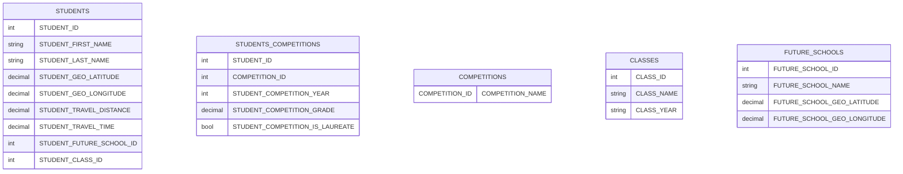

# Wizualizacja danych

Do zrobienia interaktywne ikonografie i mapy.

Dane powinny zawierać:

1. miejsca zamieszkania dzieci (w formie lokalizacji geograficznej), odległość od szkoły oraz średni czas dojazdu w roku szkolnym.
2. Lokalizacje i nazwy szkół do których idą dzieci.
3. Klasy do których należą dzieci. Możliwość rozwinięcia szczegółowego ile dzieci z jakiej klasy idzie do jakiej szkoły.
4. Statystyka osiągnięć uczniów w konkursach. Tak, aby dało się przedstawić linię trendu w ciągu ostatnich 7 lat. Informacja ile osób było z klas 7 i 8 w zależności od konkursu i roku.
5. Liczba dzieci podchodząca do egzaminu wewnętrznego Fermat.
6. Liczba dzieci które uzyskały tytuł laureata stypendium MEN
7. Liczba dzieci które uzyskały więcej niż jeden tytuł laureata w dowolnym konkursie. Wykres, trend.
8. Lista wypowiedzi rodziców oraz uczniów.
9. Ankieta podwójna - oczekiwania i rezultaty w dwóch rodzajach dla uczniów i rodziców.
10. Sugestie rodziców i uczniów.
11. Bank zweryfikowanych kontaktów referencyjnych.

I to tyle na początek

